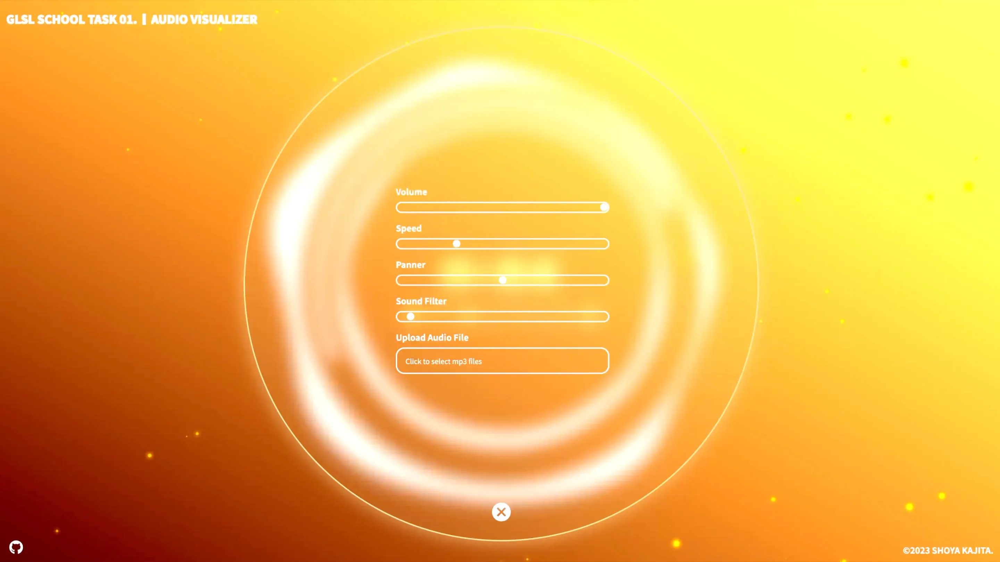
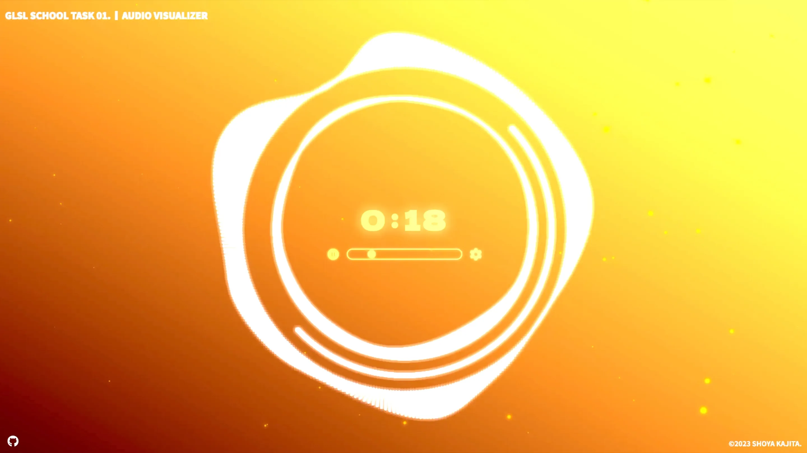

# 🪬 ~ 課題内容

今回は、まず頂点の個数を単純にどんどん増やしてみましょう。<br>
今はまだ奥行きのある状態を扱っていないので、ひとまず XY 平面上に大量に配置してみましょう。（数千～数万程度）規則正しく並べてみてもいいですし、ランダムに配置してみても面白いかもしれません。マウスとのインタラクションなども実装できたらなお良いでしょう。

## 👾 ~ Demo

- https://dev.shoya-kajita.com/033/





## 🎮 ~ Getting Started

- node: v18.15.0
- npm: 9.5.0

```
// install
npm i

// development
npm run dev

// production
npm run build

// build preview
npm run preview
```

## 📝 ~ Note

- [`gl_PointCoord`を丸くする方法](https://marina.sys.wakayama-u.ac.jp/~tokoi/?date=20110324)
